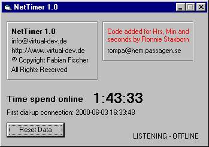



## NetTimer \(UPDATE\)

### Description

Kepp track of your Internet Time.

This code is an update of Fabian Fischer's NetTimer. Added some codes to it. It now show you the hours, minutes and seconds instead of only minutes. Added new code for the loggbook.
 
### More Info
 

             |
---                |---
**Submitted On**   |2000-06-05 02:19:46
**By**             |[Ronnie Staxborn](https://github.com/Planet-Source-Code/PSCIndex/blob/master/ByAuthor/ronnie-staxborn.md)
**Level**          |Intermediate
**User Rating**    |3.5 (14 globes from 4 users)
**Compatibility**  |VB 5\.0, VB 6\.0
**Category**       |[Internet/ HTML](https://github.com/Planet-Source-Code/PSCIndex/blob/master/ByCategory/internet-html__1-34.md)
**World**          |[Visual Basic](https://github.com/Planet-Source-Code/PSCIndex/blob/master/ByWorld/visual-basic.md)
**Archive File**   |[CODE\_UPLOAD6431642000\.zip](https://github.com/Planet-Source-Code/ronnie-staxborn-nettimer-update__1-8632/archive/master.zip)

